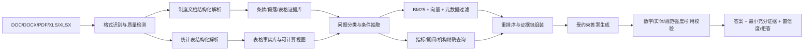

# 面向银行业监管制度与统计报表的可信 RAG 问答

## 解题技术方案与 8 月 31 日交付计划（初稿）

> 版本：v0.1  
> 编制日期：2026-08-04  
> 目标提交日：2026-08-31  
> 依据：南京银行赛题说明、`Data/originalData` 文件统计及代表性样本检查

## 1. 结论先行

本题不适合做成单一路径的“文档切块—向量检索—大模型回答”。推荐采用“双证据引擎 + 可信校验层”的路线：

1. **制度文本引擎**：负责监管条款、定义、适用范围、流程、阈值、禁止性规定等问题，使用结构化切分、关键词与语义混合检索、元数据过滤和重排序。
2. **统计表格引擎**：负责精确取数、计算、比较和趋势问题，把 Excel 转成可查询的表格事实，优先通过确定性查询和计算得到答案，而不是让大模型“读表猜数”。
3. **可信校验层**：逐项核验回答中的数字、日期、机构、文号、规范强度和证据位置；证据不足时澄清或拒答。

比赛策略上，应先把官方 300 条 QA 覆盖的高频题型和 48 个文件做成高可靠“黄金路径”，再扩展至全部 500 份附件。目标不是堆复杂 Agent，而是用可复现、可解释的工程链路稳定超过赛题指标。

## 2. 赛题要求拆解

### 2.1 必须解决的能力

- 支持 Word、PDF、Excel 等多源异构资料。
- 保存并利用标题层级、条款编号、表头、单位、期间、适用对象、发文机关、发布日期、文件版本等结构信息。
- 支持文件名、监管主题、业务领域、条款编号、指标名称和期间等条件过滤。
- 回答制度事实、条款/阈值、业务流程、统计取数、跨文件场景判断等问题。
- 返回条款级、段落级和表格单元级证据。
- 对数字、日期、机构名称、文号和“应当/可以/不得/原则上”等规范强度进行严格控制。
- 对库外问题、歧义问题和证据不足问题主动澄清或拒答。
- 交付可运行系统或 API、结构化知识库、数据处理脚本、评测集、评测报告、运行说明和可复现环境。

### 2.2 赛题量化验收线

| 指标 | 赛题建议值 | 项目内部目标 |
|---|---:|---:|
| 制度事实类准确率 | ≥ 85% | ≥ 90% |
| 表格取数类准确率 | ≥ 80% | ≥ 92% |
| 证据引用命中率 | ≥ 90% | ≥ 95% |
| 关键数字/日期/机构/文号错误率 | ≤ 5% | ≤ 2% |
| 库外或依据不足问题拒答/澄清率 | ≥ 80% | ≥ 90% |
| 文件入库规模 | ≥ 200 份 | 500 份附件全部可入库 |

内部目标应高于赛题线，给隐藏测试、格式异常和模型波动留出余量。

## 3. 已提供数据的初步判断

### 3.1 实际目录统计

`Data/originalData` 当前约 116.5 MB，共 501 个有效文件：500 份 NFRA 附件和 1 份 QA 工作簿。

| 类型 | 数量 | 主要用途与难点 |
|---|---:|---|
| `.xls` | 232 | 旧格式统计表；需保留原始数值、显示格式、合并表头和单位 |
| `.xlsx` | 158 | 新格式统计表及 QA；存在跨期表、季度表和多级表头 |
| `.pdf` | 45 | 制度与附件；需保留页码、版面坐标，必要时 OCR |
| `.docx` | 34 | 条款文本及复杂表格；需保留标题层级和表格位置 |
| `.doc` | 32 | 旧 Word 格式；需先稳定转换再解析 |

代表性抽样发现：

- 《银行函证工作操作指引》DOCX 达 69 页、1475 个段落、44 张表，说明不能只抽取纯文本。
- 《商业银行风险评估标准》旧 `.doc` 有清晰的章、节、项、数字编号层级，适合按“父标题路径 + 条款”切分。
- 监管指标 Excel 同时存在 `.xls/.xlsx`、月度/季度、不同年份和略有差异的布局。
- Excel 的显示文本可能已经四舍五入，而 QA 证据保留更高精度的原始值；入库必须同时保存 `raw_value`、`display_value` 和 `number_format`。
- 45 份 PDF 抽样均可抽出文本，但仍需设置“低文本密度/乱码/页面图像占比”检测，触发 OCR 兜底。

### 3.2 QA 数据比赛题说明更丰富

赛题说明提到 42 条种子问答，但实际 `QA数据.xlsx` 有 300 条四选一题：

| 维度 | 分布 |
|---|---|
| 来源格式 | Excel 100、Word 100、PDF 100 |
| 难度 | easy 102、medium 99、hard 99 |
| 题型 | 单事实检索 134、多事实检索 66、表格取数 34、表格计算 33、表格比较 33 |
| 覆盖范围 | 43 个 source title、48 个具体文件标签 |

这 300 条数据非常适合做开发集和回归测试，但不宜简单随机拆分：同一文件、同一模板的题目高度相似，随机拆分会造成数据泄漏和虚高分数。建议按 `file_label/source_title` 分组切分，并额外制作开放式问答与拒答集。

### 3.3 当前数据治理问题

- 赛题说明称存在 manifest、JSONL、CSV，但当前目录未发现这些文件。
- 附件编号从 001 到 507，中间缺少 436、437、438、439、440、442、450；应确认是正常跳号还是数据缺失。
- QA 中的证据路径以 `data/raw/...` 开头，与当前实际目录 `Data/originalData/...` 不一致，需要统一路径映射。
- 存在内容重复或不同格式的同源文件，如同一材料同时有 DOCX/PDF；需按 SHA-256 和规范化内容指纹做去重/关联，而不是直接丢弃其中一种格式。

因此，第一项工程任务应是生成自己的 manifest，而不是直接开始向量化。

## 4. 推荐总体架构



核心原则：**大模型负责理解、路由、解释和组织语言；检索系统负责找依据；程序负责数字计算和一致性校验。**

## 5. 分阶段技术路线

### 5.1 数据清单与版本治理

为每个文件生成 `document_manifest`：

```text
doc_id, source_title, file_label, extension, local_path,
sha256, canonical_hash, source_url, authority, publish_date,
effective_date, expiry_date, version_status, parent_doc_id,
file_size, parser_version, parse_status, parse_warnings
```

需要实现：

- 规范化文件名、全半角字符、年份/月/季度和监管机构别名。
- SHA-256 文件去重 + 规范化文本指纹近重复检测。
- DOCX/PDF 同源材料建立 `same_source_group`，保留两种证据坐标。
- 新旧规冲突时优先使用有效、较新、权威层级更高的版本，并把冲突展示给用户。
- 每次解析与索引记录版本号，确保评测可以复现。

### 5.2 制度文档解析

按格式分别处理：

- `.doc`：通过 LibreOffice/Word 转换为 `.docx` 或 PDF，保留原文件哈希和转换日志。
- `.docx`：抽取标题、段落、编号列表、表格、脚注、页眉页脚；建立章—节—条—款—项路径。
- `.pdf`：优先文本层解析，保存页码和块坐标；文本密度过低或乱码时触发 OCR；表格页用表格检测器单独解析。

禁止简单按固定 token 切块。建议使用三层证据对象：

1. `section`：章节级上下文，用于理解主题和适用范围。
2. `clause`：条款/段落级最小检索单元，保留父标题和相邻条款。
3. `table_region`：文档内表格，保留表题、表头、行列位置和所在页。

一个文本证据块建议包含：

```text
evidence_id, doc_id, section_path, clause_no, paragraph_no,
page_no, bbox, text, normative_terms, entities, dates,
amounts, percentages, applicability, exceptions
```

切块长度不设为死值：完整条款优先；过长条款按语义段拆分并共享父级上下文；过短条款与相邻条款组成检索窗口，但引用仍指向原始最小证据。

### 5.3 统计表解析与事实化

不要把 Excel 整张表转成 Markdown 后交给大模型。推荐同时生成两种表示：

1. **表格语义描述**：供关键词/向量检索定位工作簿、工作表、指标和期间。
2. **长表事实记录**：供 SQL/程序精确取数、比较和计算。

表格事实建议字段：

```text
table_id, doc_id, sheet_name, table_title, source_period,
metric_path, row_label, column_header_path, institution_type,
region, period, value_raw, value_display, value_type,
unit, number_format, formula, cell_address, footnote, evidence_id
```

关键处理规则：

- 对合并单元格做表头向下/向右传播，生成完整 `column_header_path`。
- 区分“本月值、本年累计、期末余额、同比、占比”等口径。
- 单位从表题、单位行、列头和脚注四处联合判定，不能默认整表同单位。
- 保存原始数值精度；展示时遵循原单元格格式。
- 取数通过精确维度过滤；计算题通过程序执行差额、增长率、排序、汇总，并记录计算表达式和参与单元格。
- 任何无法唯一匹配的指标/期间/机构先澄清，不让模型任选一个数字。

### 5.4 问题路由和条件抽取

先把问题分为：

- 制度单事实检索
- 制度多事实/多条款检索
- 表格取数
- 表格计算
- 表格比较/趋势
- 制度 + 表格跨文件场景判断
- 库外/证据不足/问题歧义

同时抽取文件名、监管机构、主题、条款号、指标、机构类型、地区、年份/月/季度、统计口径、单位和计算动作。优先用规则与词典识别明确字段，大模型只补充复杂语义。

### 5.5 混合检索

制度文本推荐四段式召回：

1. 标题/文件名/文号精确匹配。
2. 元数据过滤：年份、发文机关、主题、有效状态、文件类型等。
3. BM25 关键词检索与语义向量检索并行。
4. 对候选条款做跨编码器重排序，并通过 RRF 或学习排序融合。

表格问题推荐先定位 `table_id`，再用指标、期间、机构、地区、口径执行结构化查询。只有表头/指标名称模糊时才使用语义匹配，数值本身不进入“生成式猜测”。

多跳问题最多采用 2～3 步显式计划，例如：

1. 在制度文件中找到指标定义和统计口径。
2. 用口径约束定位对应统计表与单元格。
3. 程序计算变化并由模型解释，但每个结论绑定证据。

### 5.6 受约束生成与可信校验

回答模板建议固定为：

1. **直接答案**：先给结论或数值。
2. **依据与解释**：只使用证据包中的内容。
3. **引用**：文件名 + 章节/条款或页码；Excel 为工作表 + 单元格 + 单位 + 期间。
4. **适用边界**：版本、对象、例外或统计口径。
5. **置信状态**：明确、需澄清或依据不足。

生成后执行硬校验：

- 回答中的每个关键数字必须能在证据单元格或计算日志中回溯。
- 日期、机构、文号和条款号必须与证据精确一致。
- “不得、应当、可以、原则上”等词不得改写成不同强度。
- 引用片段必须真正支持相邻结论，避免“有引用但不支持答案”。
- 若证据冲突、版本不明或关键维度缺失，则输出澄清问题或拒答。

### 5.7 建议实现栈

优先选择团队熟悉、可离线复现的组件，避免在最后两周更换底座：

- 服务：Python + FastAPI。
- 数据处理：格式专用解析器；`.doc/.xls` 增加 Office/LibreOffice 转换兼容层。
- 文本索引：支持中文分词、BM25、向量和元数据过滤的检索引擎；若部署资源有限，可用 BM25 索引 + 本地向量库组合。
- 表格事实库：DuckDB 或 PostgreSQL；规模不大时 DuckDB 更便于打包复现。
- 向量模型与重排序模型：选中文及金融文本效果稳定的 embedding/reranker 候选，在开发集上 A/B 测试后确定，不凭模型名直接拍板。
- 生成模型：封装统一 LLM 接口，至少支持一个主模型和一个可替换备选；提示词、温度和最大上下文版本化。
- 部署：Docker Compose；CPU 可运行基础版，GPU 作为向量化、OCR 和本地模型加速选项。
- 前端：轻量 Web 演示，重点展示证据展开、表格单元格定位、计算过程和拒答案例。

## 6. 评测方案

### 6.1 数据集划分

- 不按单条 QA 随机划分。
- 以 `file_label` 或 `same_source_group` 为分组，避免同模板、同文件泄漏。
- 300 条官方 QA 可先做 60% 开发、20% 验证、20% 本地盲测；固定随机种子并保存清单。
- 额外制作至少 60 条开放式问答：制度事实、阈值、流程、跨条款、表格取数、计算、比较各 8～10 条。
- 额外制作至少 30 条拒答/澄清题：库外事实、缺期间、缺机构、同名指标、旧规冲突、错误前提。

### 6.2 分层指标

| 层级 | 建议指标 |
|---|---|
| 解析 | 文件成功率、标题/条款识别率、表头展开准确率、单位/期间识别率、坏文件清单 |
| 召回 | Recall@5、Recall@10、MRR、目标文件命中率、目标单元格候选命中率 |
| 回答 | 选择题准确率、Exact Match、数值容差准确率、开放式答案要点 F1 |
| 证据 | 引用命中率、引用精确率、最小充分证据率、单元格坐标准确率 |
| 可信 | 关键字段错误率、无依据陈述率、拒答 precision/recall、版本冲突识别率 |
| 工程 | p50/p95 延迟、失败率、峰值内存、离线复现成功率 |

每次实验至少记录：数据版本、解析器版本、索引版本、模型与参数、提示词版本、指标结果、失败样例和运行时间。

### 6.3 必做对照实验

- 纯向量检索 vs BM25 vs 混合检索。
- 无重排序 vs 有重排序。
- 固定长度切块 vs 条款结构化切块。
- Excel 文本化 RAG vs 表格事实库精确查询。
- 无校验生成 vs 数字/实体/引用校验。
- 不做元数据过滤 vs 标题/期间/版本过滤。

这些对照实验既能指导优化，也能直接形成评测报告和答辩亮点。

## 7. 最小可行产品与最终作品边界

### 7.1 第一阶段 MVP（必须先做成）

- 500 文件 manifest 和解析状态页。
- 300 条 QA 所涉及 48 个文件全部可靠解析。
- 五类 QA 的自动评测脚本。
- 制度文本混合检索、表格精确查询、统一引用格式。
- FastAPI `/ask` 与 `/evidence/{id}` 接口。
- 一个能展示答案、证据、表格单元格和拒答的简单页面。

### 7.2 最终作品增强项

- 全量 500 文件入库和质量报告。
- 新旧版本关联、冲突提示和有效性过滤。
- 多跳“制度口径 + 统计取数”问题。
- 证据高亮、计算过程展开、解析错误人工修订入口。
- 自动评测看板、失败样例聚类、检索/生成消融实验。

### 7.3 暂不建议优先投入

- 复杂多 Agent 自主协作框架。
- 大规模微调或从零训练模型。
- 过早构建知识图谱全套平台。
- 追求炫酷但不能提高指标的前端动画。

在 27 天周期内，这些方向容易消耗时间，却未必改善证据命中和数字准确率。

## 8. 从 8 月 4 日到 8 月 31 日的倒排计划

### 8.1 里程碑计划

| 日期 | 阶段 | 主要任务 | 必须产出 | 验收门槛 |
|---|---|---|---|---|
| 8/4–8/5 | 需求冻结 | 核对赛题指标；建立仓库规范、环境、QA 分组划分和实验记录模板 | 技术方案 v1、数据审计脚本、任务看板 | 团队对 MVP、接口、指标口径达成一致 |
| 8/6–8/10 | 数据底座 | manifest；DOC/DOCX/PDF/XLS/XLSX 解析；条款层级；Excel 长表事实化；坏文件报告 | 结构化样本库、解析器、质量报告 | QA 涉及 48 文件解析成功率 100%；全量文件解析成功率 ≥ 95% |
| 8/11–8/15 | 检索基线 | 问题分类；标题/文号/期间抽取；BM25+向量+过滤；表格 SQL 查询；自动评测 | 可运行检索 API、基线报告 | 目标证据 Recall@10 ≥ 95%；表格目标单元格候选命中 ≥ 95% |
| 8/16–8/20 | 可信问答 | 重排序；答案模板；条款/页码/单元格引用；数字与实体校验；澄清/拒答 | 端到端 `/ask`、可信校验日志 | 官方 QA 总准确率 ≥ 88%；引用命中 ≥ 92%；关键字段错误 ≤ 5% |
| 8/21–8/24 | 强化优化 | 多跳场景；版本冲突；难例分析；开放式与拒答集；消融实验 | 优化报告、失败样例库、冻结候选版本 | 制度 ≥ 90%；表格 ≥ 92%；引用 ≥ 95%；拒答 ≥ 85% |
| 8/25–8/27 | 产品集成 | Web 演示；证据高亮；计算过程；Docker；从空环境复现 | 演示系统、镜像/部署脚本、运行说明 | 新环境一键启动；核心演示用例连续通过 |
| 8/28–8/29 | 材料制作 | 技术报告、架构图、演示视频、答辩稿、创新点与对照实验 | 提交包候选版、视频候选版 | 按赛事清单逐项自检，无缺件 |
| 8/30 | 冻结与演练 | 代码冻结；全量回归；断网/低资源演练；备份；答辩彩排 | Release Candidate、校验和、备份 | 两次完整部署与演示均成功 |
| 8/31 | 最终提交 | 上午完成最终核验并提交；保留下午处理平台或材料问题 | 正式提交记录 | 不在截止前最后一小时上传 |

### 8.2 未来 72 小时具体行动

#### 8 月 4 日

- 建任务看板并明确负责人。
- 固定 QA 分组切分策略和评测脚本输入/输出格式。
- 生成 501 文件 manifest、哈希、格式、编号、解析状态和同源关系。
- 定义统一 `Evidence`、`TextChunk`、`TableFact` 数据结构。

#### 8 月 5 日

- 打通 `.doc/.docx/.pdf` 各 3～5 份代表样本解析。
- 打通 `.xls/.xlsx` 各 5 份代表样本，验证原始数值精度、单位、期间和单元格坐标。
- 先完成 QA 涉及的 48 个文件映射，修正 `data/raw` 到实际路径的映射。

#### 8 月 6 日

- 实现最小文本 BM25/向量检索基线。
- 实现表格取数的精确查询基线。
- 跑第一版 300 题，输出按格式、题型、难度和文件的错误分布。

## 9. 建议团队分工

若团队为 4 人，可按以下角色并行；人数更少时合并相邻角色：

| 角色 | 主要责任 | 每日可核验产出 |
|---|---|---|
| 数据与解析 | manifest、格式转换、条款/表格结构化、质量报告 | 新增成功解析文件数、坏例和修复记录 |
| 检索与表格推理 | 混合召回、重排序、SQL 查询、计算引擎 | Recall@k、单元格命中率、失败查询 |
| 生成与可信评测 | Prompt、引用、校验、拒答、自动评测 | 分题型准确率、引用率、关键字段错误率 |
| 系统与交付 | API、Web、Docker、日志、报告、视频和答辩 | 可部署版本、演示用例、提交材料状态 |

每日 15 分钟站会只回答：昨天产出、今天验收点、当前阻塞；所有实验必须落表，避免凭感觉调参。

## 10. 主要风险与应对

| 风险 | 影响 | 应对 |
|---|---|---|
| 旧 `.doc/.xls` 转换不稳定 | 部分文件无法入库 | 双路径转换；保留转换日志；坏文件进入人工修复队列 |
| 表头/单位/期间识别错误 | 数字正确但口径错误 | 完整表头路径、单位规则、QA 单元格回归、歧义澄清 |
| 同名文件和新旧版本混淆 | 引用过期制度 | manifest 中维护版本状态、日期和同源关系；检索强制过滤 |
| QA 模板泄漏导致虚高 | 隐藏测试失分 | 按文件分组切分，增加开放式和拒答集 |
| 大模型改写规范强度或数字 | 合规性失败 | 关键字段抽取后硬校验；数字由程序填充而非自由生成 |
| OCR 或复杂表格拖慢响应 | 延迟不达标 | OCR 仅离线入库；缓存解析、检索和常见查询结果 |
| 最后阶段仍频繁换模型/框架 | 无法稳定复现 | 8 月 24 日前冻结核心技术栈，之后只修缺陷和做材料 |
| 提交材料准备过晚 | 技术完成但无法参赛 | 8 月 25 日开始同步写报告和录视频，8 月 30 日冻结 |

## 11. 可用于答辩的创新点

1. **制度文本与统计表格双引擎**：避免用同一种切块方式处理完全不同的数据形态。
2. **最小充分证据**：条款、页码、工作表、单元格和计算日志都能回溯。
3. **监管规范强度保护**：对“不得/应当/可以”等进行抽取、比对和错误拦截。
4. **版本与适用性治理**：不仅检索相似内容，还判断有效期、发文机关、适用对象和例外。
5. **确定性表格推理**：取数、比较和计算由程序完成，大模型只解释结果。
6. **证据不足即澄清/拒答**：把“不回答错问题”作为可信能力，而不是失败。
7. **全链路可复现评测**：解析、召回、生成、引用、拒答和延迟均有版本化指标。

## 12. 项目验收清单

### 数据与解析

- [ ] 501 个文件全部进入 manifest，缺失/损坏/重复有记录。
- [ ] QA 涉及的 48 个文件解析成功并有单元测试。
- [ ] 文本证据保留标题路径、条款号、页码或段落定位。
- [ ] 表格证据保留工作表、表题、行列头、单位、期间、原始值和单元格。

### 检索与问答

- [ ] 五类 QA 均有独立路由和指标。
- [ ] 关键词、向量、元数据和表格查询均可单独测试。
- [ ] 每个关键结论都有真正支持它的证据。
- [ ] 数字计算可回放，版本冲突可提示，证据不足可拒答。

### 工程与交付

- [ ] API、Web、Docker/环境配置和运行说明齐全。
- [ ] 300 题自动评测、开放式集、拒答集和消融实验可复现。
- [ ] 报告、演示视频、答辩稿、架构图和提交清单齐全。
- [ ] 8 月 30 日完成代码与材料冻结，8 月 31 日上午提交。

## 13. 下一步决策点

团队启动会只需尽快确认以下事项：

1. 团队人数及每人的可投入时间。
2. 是否允许调用外部大模型 API，还是必须完全本地部署。
3. 比赛平台对响应时间、网络、GPU/CPU、接口格式和提交包大小的具体限制。
4. 当前团队最熟悉的检索引擎与前端框架。

这些信息会影响实现选型，但不会改变“双证据引擎 + 可信校验层”的总体路线。
