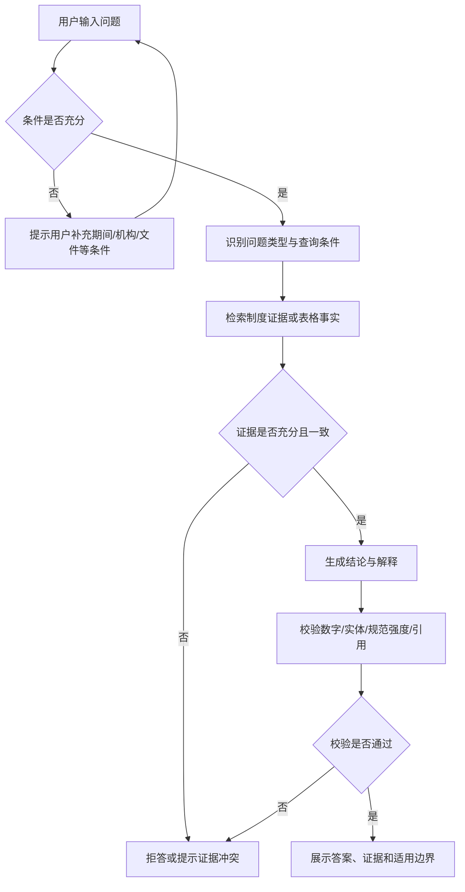

# 面向银行业监管制度与统计报表的可信 RAG 问答系统 PRD

> 文档版本：v0.1  
> 文档状态：评审初稿  
> 编制日期：2026-08-04  
> 目标提交日期：2026-08-31  
> 产品代号：ReguRAG（暂定）  
> 适用范围：第五届中国研究生金融科技创新大赛——南京银行赛题

## 1. 文档目的

本文档从产品经理视角定义参赛作品要解决的用户问题、产品边界、核心流程、功能需求、业务规则、成功指标和验收标准，用于：

- 团队统一产品目标，避免将项目做成单纯的算法 Demo。
- 指导产品、数据、算法、后端、前端和测试拆分任务。
- 作为 8 月 31 日提交前的功能取舍和验收依据。
- 为技术报告、演示视频和现场答辩提供一致的产品叙事。

本文档不展开模型参数、索引实现和具体代码设计；相关内容以技术方案为准。

## 2. 产品概述

### 2.1 一句话定义

ReguRAG 是一个面向银行从业人员的可信监管知识助手，能够从监管制度和统计报表中回答事实、条款、流程、指标、取数、比较和场景合规问题，并为每个关键结论提供可定位、可核验的原始证据。

### 2.2 产品愿景

让银行业务人员在需要监管依据时，不再依赖人工翻找多份文件，而是能够快速获得“结论明确、口径准确、证据可查、边界清楚”的答案。

### 2.3 产品价值主张

| 传统方式的问题 | 产品提供的价值 |
|---|---|
| 制度分散，检索耗时 | 一处提问，跨 Word、PDF、Excel 检索 |
| 容易误用旧规或同名文件 | 展示发文机关、日期、版本和适用边界 |
| 条款定位不准 | 返回章节、条款、页码和原文片段 |
| 表格指标口径容易混淆 | 明确期间、机构、地区、单位和单元格 |
| 大模型容易编造数字或依据 | 数字由表格事实查询/计算，生成后再次校验 |
| 回答看似合理但无法复核 | 结论与证据逐项绑定，可展开查看原文 |

## 3. 背景与问题定义

### 3.1 业务背景

银行日常经营管理涉及信贷审批、风险分类、资本管理、消费者权益保护、反洗钱、支付结算、普惠金融和监管报送等场景。业务人员需要频繁查询监管制度、政策规章、统计报表和操作文件。

相关资料分散在不同监管渠道中，文件类型包含 DOC、DOCX、PDF、XLS、XLSX；同一主题还可能存在正文、附件、新旧版本和不同统计期间。普通搜索或通用大模型难以同时满足精确检索、表格计算、版本判断和证据追溯要求。

### 3.2 核心用户问题

1. 我知道大概主题，但不知道规定在哪份文件、哪一条。
2. 我找到了相似规定，但不确定是不是最新或适用于当前机构。
3. 我需要一个监管指标的具体数值，但不确定表格、期间、单位和统计口径。
4. 我需要比较两个期间或两个机构的数据，不希望手工复制计算。
5. 我需要判断一个业务场景是否合规，并看到判断所依据的全部条款。
6. 我需要把答案交给同事或用于复核，因此必须证明结论来自哪里。

### 3.3 当前数据基础

- 500 份 NFRA 监管制度与统计附件。
- 1 份包含 300 条四选一问题的 QA 工作簿。
- 文件类型覆盖 `.doc`、`.docx`、`.pdf`、`.xls`、`.xlsx`。
- QA 题型包括单事实检索、多事实检索、表格取数、表格计算和表格比较。

## 4. 产品目标与非目标

### 4.1 产品目标

| 编号 | 目标 | 衡量方式 |
|---|---|---|
| G1 | 用户能用自然语言查询监管制度和统计报表 | 五类核心问题均有可用闭环 |
| G2 | 回答中的关键结论可追溯 | 证据引用命中率达到内部目标 |
| G3 | 表格数字和计算结果准确 | 数值可回溯到单元格和计算过程 |
| G4 | 降低误用旧规、错口径和模型幻觉 | 展示版本、期间、单位、适用对象并执行校验 |
| G5 | 证据不足时不强行回答 | 支持澄清和拒答，记录触发原因 |
| G6 | 作品可部署、可演示、可复现 | 从空环境完成部署并跑通评测 |

### 4.2 非目标

本版本不承诺：

- 替代银行法律、合规或风险部门作出最终专业决定。
- 接入客户信息、账户数据、交易流水等内部敏感数据。
- 覆盖全部金融监管机构和全部历史法规。
- 自动执行审批、报送、处罚判断等业务操作。
- 构建通用聊天机器人或与赛题无关的开放域问答。
- 在 8 月 31 日前建设复杂的多 Agent 平台或完整知识图谱平台。

## 5. 用户与角色

### 5.1 主要用户

| 用户角色 | 典型任务 | 核心诉求 |
|---|---|---|
| 银行业务人员 | 查询流程、材料、阈值和禁止性规定 | 快速、明确、能直接定位依据 |
| 合规/风险人员 | 复核业务场景、检查适用范围和例外 | 证据完整、规范强度准确、版本清晰 |
| 监管报送/数据人员 | 查询指标定义、期间数据和变动 | 单位口径准确、可计算、可追溯单元格 |
| 研究/管理人员 | 跨文件查找政策与行业数据 | 能比较、多跳分析、引用方便 |

### 5.2 管理用户

| 用户角色 | 典型任务 | 核心诉求 |
|---|---|---|
| 知识库管理员 | 上传文件、查看解析状态、处理异常、维护版本 | 入库透明、问题可定位、更新可回滚 |
| 项目评测人员 | 运行 QA、查看分题型结果和失败样例 | 指标客观、实验可复现、结果可导出 |
| 系统管理员 | 配置模型、索引、权限和运行环境 | 配置集中、日志完整、运行稳定 |

## 6. 产品原则

1. **证据优先**：没有足够证据，不生成确定性结论。
2. **结论与证据绑定**：引用不是装饰，每条引用必须支持对应结论。
3. **数字由程序负责**：表格取数、比较和计算使用确定性查询与计算。
4. **口径显式化**：期间、单位、机构、地区、统计口径必须可见。
5. **版本显式化**：同主题多版本时主动提示，不静默选择。
6. **最小充分展示**：先呈现直接答案，再按需展开依据和计算过程。
7. **可复现**：同一数据版本与系统版本下，评测结果可重复获得。

## 7. 产品范围与版本优先级

### 7.1 P0：比赛必须交付

- 自然语言问答首页。
- 制度单事实和多事实问答。
- Excel 表格取数、计算和比较。
- 答案引用与原文/单元格定位。
- 问题澄清与证据不足拒答。
- QA 涉及文件的稳定入库及全部 500 文件的批量入库能力。
- 知识库文件列表、解析状态和异常提示。
- 300 条 QA 自动评测与结果展示。
- 可运行 API、轻量 Web、运行说明和可复现环境。

### 7.2 P1：显著增强答辩效果

- 制度版本关联、有效性与冲突提示。
- “制度口径 + 统计报表”跨文件问答。
- 证据原文高亮和表格行列上下文展示。
- 计算步骤展开、引用复制和答案导出。
- 失败样例分类、解析质量和评测看板。

### 7.3 P2：赛后或时间充足时

- 用户反馈闭环和人工修订台。
- 多轮会话中的条件继承与纠错。
- 更细粒度权限和多知识库隔离。
- 监管更新订阅与自动增量入库。
- 复杂关系图谱与更长链路的任务型 Agent。

## 8. 产品信息架构

```text
ReguRAG
├─ 问答工作台
│  ├─ 新建提问
│  ├─ 条件限定
│  ├─ 答案与可信状态
│  ├─ 证据面板
│  └─ 历史记录
├─ 知识库管理
│  ├─ 文件清单
│  ├─ 文件详情
│  ├─ 解析状态
│  ├─ 同源/版本关系
│  └─ 异常处理
├─ 评测中心
│  ├─ 评测任务
│  ├─ 指标总览
│  ├─ 分题型结果
│  └─ 失败样例
└─ 系统信息
   ├─ 数据/索引/模型版本
   ├─ 运行状态
   └─ 审计日志
```

比赛演示的主路径必须聚焦“问答工作台”，管理和评测页面用于证明工程完整性与可复现性。

## 9. 核心用户流程

### 9.1 通用问答流程



### 9.2 表格问题流程

1. 识别目标统计表、指标、机构/地区、期间、单位和操作类型。
2. 若期间或口径不唯一，先要求用户补充条件。
3. 精确定位单元格或一组事实记录。
4. 取数题直接返回；计算/比较题执行确定性计算。
5. 展示结果、计算式、单位、原始单元格和表格上下文。

### 9.3 场景合规判断流程

1. 从问题中抽取主体、行为、金额、期限、业务类型和前提条件。
2. 检索适用范围、一般规定、禁止性规定和例外条款。
3. 判断是否仍缺少决定性信息。
4. 输出“符合/不符合/有条件符合/信息不足”之一。
5. 分别展示结论、适用前提、依据和风险提示。

产品文案必须提示：该结果是基于当前知识库的辅助判断，不替代正式合规审查。

## 10. 详细功能需求

优先级定义：P0 为必须完成，P1 为应完成，P2 为可延后。

### 10.1 问答输入与条件限定

| 需求编号 | 优先级 | 功能需求 | 验收标准 |
|---|---|---|---|
| FR-Q-001 | P0 | 用户可输入自然语言问题并提交 | 非空问题可提交；提交后展示处理中状态；重复点击不会生成重复请求 |
| FR-Q-002 | P0 | 支持识别制度事实、多事实、表格取数、表格计算、表格比较等类型 | 300 条 QA 均能被路由到已定义的题型；未知类型进入通用检索或澄清 |
| FR-Q-003 | P0 | 用户可选填文件、年份、机构、地区、业务领域等限定条件 | 条件进入检索并显示在结果页；用户可一键清除 |
| FR-Q-004 | P0 | 系统自动从问题抽取文件名、条款号、指标、期间、机构和计算动作 | 抽取结果用于检索；关键条件冲突时不得静默覆盖用户输入 |
| FR-Q-005 | P1 | 提供常见问题示例与一键填入 | 至少覆盖五类核心问题及一个拒答案例 |
| FR-Q-006 | P1 | 支持终止长时间请求和重新提问 | 用户终止后前端停止等待，后端记录取消状态 |

### 10.2 问题澄清

| 需求编号 | 优先级 | 功能需求 | 验收标准 |
|---|---|---|---|
| FR-C-001 | P0 | 当指标、期间、机构、地区或文件存在多个可能值时，系统要求澄清 | 不得随机选择；澄清项说明歧义来自哪里 |
| FR-C-002 | P0 | 澄清问题优先提供 2～5 个候选项 | 用户选择后可继续原请求，无需重新输入全部问题 |
| FR-C-003 | P1 | 系统在一次澄清中只询问影响答案的最少必要条件 | 不询问已有明确答案的字段；避免连续无关追问 |

示例：用户问“2025 年不良贷款余额是多少”时，如果数据中同时存在季度、机构分类等多种口径，应先询问季度和机构范围。

### 10.3 制度文本问答

| 需求编号 | 优先级 | 功能需求 | 验收标准 |
|---|---|---|---|
| FR-T-001 | P0 | 支持按文件名、文号、主题、条款号和正文语义检索 | 精确文件名/文号查询优先返回对应文件；条款号可直接定位 |
| FR-T-002 | P0 | 支持定义、适用范围、流程、阈值、期限和禁止性规定问答 | 答案保留金额、比例、日期、机构和规范强度，不得随意改写 |
| FR-T-003 | P0 | 多事实问题可返回多条证据 | 每个事实均有对应证据；不得用一条不完整证据支持全部结论 |
| FR-T-004 | P0 | 回答展示适用对象、条件和例外 | 原文存在限制条件或例外时必须在答案中体现 |
| FR-T-005 | P1 | 同主题多版本时展示版本提示 | 至少显示文件日期/版本；无法判断有效性时明确提示用户复核 |
| FR-T-006 | P1 | 支持同源 DOCX/PDF 的统一结果 | 同源文件不重复占据主要结果；用户仍可选择查看不同载体 |

### 10.4 表格取数、计算与比较

| 需求编号 | 优先级 | 功能需求 | 验收标准 |
|---|---|---|---|
| FR-X-001 | P0 | 支持按表名、工作表、指标、期间、机构和地区取数 | 返回值与原始单元格一致，并展示单位和统计口径 |
| FR-X-002 | P0 | 保存并区分原始数值与显示数值 | 计算使用原始值；展示遵循合理精度；用户可查看原始值 |
| FR-X-003 | P0 | 支持差值、增减幅、占比、排序和汇总等常见计算 | 结果展示公式、输入值、单位和来源单元格；除零等异常有明确提示 |
| FR-X-004 | P0 | 支持跨月份、季度、机构或地区比较 | 比较对象及各自口径可见；不同单位或不可比口径不得直接计算 |
| FR-X-005 | P0 | 展示单元格级证据 | 至少包含文件名、工作表、单元格、行列标签、期间、单位和原始值 |
| FR-X-006 | P1 | 展示目标单元格附近的表格上下文 | 用户可看到相关行列头和邻近数据，目标单元格高亮 |
| FR-X-007 | P1 | 指标名称模糊时给出候选指标 | 候选项来自实际表头或指标词典，不由模型自由编造 |

### 10.5 跨文件与场景判断

| 需求编号 | 优先级 | 功能需求 | 验收标准 |
|---|---|---|---|
| FR-M-001 | P1 | 支持跨两份及以上文件组合证据 | 答案中区分每份文件的作用，并分别引用 |
| FR-M-002 | P1 | 支持先查制度口径、再查统计数据 | 统计查询使用制度检索得到的口径；全过程可展开查看 |
| FR-M-003 | P1 | 支持“符合/不符合/有条件符合/信息不足”场景结论 | 结论必须列出前提、依据和缺失信息；禁止只给二元判断 |
| FR-M-004 | P1 | 发现条款冲突或版本不明时提示风险 | 不把冲突内容拼接成确定性结论；提供冲突来源 |

### 10.6 答案展示

每次成功回答应按以下结构展示：

1. **直接答案**：一到三句话给出结论。
2. **依据与解释**：说明结论如何由证据得到。
3. **统计口径/适用边界**：展示期间、单位、对象、版本、条件和例外。
4. **证据列表**：可展开的条款、段落、页码或单元格证据。
5. **计算过程**：仅在计算/比较题出现。
6. **可信状态**：已核验、需澄清、依据不足或证据冲突。

| 需求编号 | 优先级 | 功能需求 | 验收标准 |
|---|---|---|---|
| FR-A-001 | P0 | 直接答案置于结果顶部 | 用户无需展开证据即可看见结论；拒答时顶部说明原因 |
| FR-A-002 | P0 | 关键数字、日期、机构、文号和规范词可识别 | 关键字段与证据一致；校验失败不得显示为“已核验” |
| FR-A-003 | P0 | 展示可信状态和依据数量 | 状态含义清晰；不得用虚构百分比表示“模型信心” |
| FR-A-004 | P1 | 支持复制答案与引用 | 复制内容保留来源标题及定位信息 |
| FR-A-005 | P1 | 支持用户对答案标记“有帮助/无帮助/引用错误/数字错误” | 反馈与问题、答案、系统版本关联保存 |

### 10.7 证据查看与追溯

| 需求编号 | 优先级 | 功能需求 | 验收标准 |
|---|---|---|---|
| FR-E-001 | P0 | 制度证据显示文件标题、章节/条款、页码或段落位置和原文 | 用户可区分回答文本与原文；不得只显示内部 `doc_id` |
| FR-E-002 | P0 | 表格证据显示文件、工作表、单元格、表头路径、单位和期间 | 所有关键数值至少有一个可定位证据 |
| FR-E-003 | P0 | 引用与具体结论相邻展示 | 用户能判断哪条证据支持哪句话 |
| FR-E-004 | P1 | 点击引用打开证据侧边栏并高亮相关内容 | 展开后无需在整份文件中再次搜索 |
| FR-E-005 | P1 | 显示来源文件元数据 | 包含文件类型、发文机关、发布日期/统计期间和版本状态 |

### 10.8 拒答与异常答案

系统必须区分以下状态：

| 状态 | 触发条件 | 展示方式 |
|---|---|---|
| 需澄清 | 缺少期间、指标、机构等可由用户补充的信息 | 说明缺少什么并提供候选项 |
| 依据不足 | 知识库未找到足以支持结论的证据 | 明确不作答，展示已检索范围和建议 |
| 证据冲突 | 多份文件或版本给出不同结论 | 并列展示冲突来源，要求用户选择适用版本或人工复核 |
| 数据不可比 | 单位、期间、统计范围或定义不同 | 说明不可直接比较的原因，不执行误导性计算 |
| 系统异常 | 解析、检索、模型或服务失败 | 提供可重试提示和请求编号，不伪装成知识不足 |

| 需求编号 | 优先级 | 功能需求 | 验收标准 |
|---|---|---|---|
| FR-R-001 | P0 | 系统不得使用库外常识补齐关键监管事实 | 证据不足时进入拒答；回答不出现无来源的关键结论 |
| FR-R-002 | P0 | 拒答需说明原因而不是只说“不知道” | 至少说明缺失证据、歧义或冲突类型 |
| FR-R-003 | P0 | 区分业务拒答和系统错误 | 两类状态使用不同文案、日志和重试逻辑 |
| FR-R-004 | P1 | 提供下一步建议 | 如补充期间、指定文件、查看候选版本或联系专业人员复核 |

### 10.9 历史记录

| 需求编号 | 优先级 | 功能需求 | 验收标准 |
|---|---|---|---|
| FR-H-001 | P1 | 保存本地或当前会话的提问历史 | 可重新打开问题、答案和证据；记录当时的数据/模型版本 |
| FR-H-002 | P2 | 支持按关键词和状态筛选历史 | 可筛选成功、澄清、拒答和异常请求 |
| FR-H-003 | P2 | 支持删除历史记录 | 删除后界面不可见，并按产品约定处理审计记录 |

### 10.10 知识库管理

| 需求编号 | 优先级 | 功能需求 | 验收标准 |
|---|---|---|---|
| FR-K-001 | P0 | 展示全部文件的类型、大小、哈希、路径、解析和索引状态 | 500 个附件均有记录；失败文件可筛选 |
| FR-K-002 | P0 | 支持批量入库和重新解析 | 重跑不产生无控制的重复证据；处理过程有状态和日志 |
| FR-K-003 | P0 | 展示解析警告 | 空文本、乱码、表头失败、缺单位、重复文件等有明确标记 |
| FR-K-004 | P1 | 管理同源文件和版本关系 | DOCX/PDF 同源材料可关联；新旧版本可并列查看 |
| FR-K-005 | P1 | 支持人工停用错误或过期文件 | 停用后不参与默认回答；历史评测仍可追溯原版本 |
| FR-K-006 | P1 | 展示文件内证据概览 | 可查看章节数、条款数、表格数、工作表数和事实记录数 |

### 10.11 评测中心

| 需求编号 | 优先级 | 功能需求 | 验收标准 |
|---|---|---|---|
| FR-V-001 | P0 | 可运行 300 条 QA 自动评测 | 支持完整运行与按来源/题型/难度运行；输出可保存 |
| FR-V-002 | P0 | 展示总准确率和分组准确率 | 至少按来源格式、难度、题型和文件展示 |
| FR-V-003 | P0 | 展示证据命中、关键字段错误和响应时间 | 指标定义固定且可追溯到单题结果 |
| FR-V-004 | P0 | 展示失败样例详情 | 包含问题、标准答案、系统答案、召回证据、错误类型和版本信息 |
| FR-V-005 | P1 | 支持两次实验结果对比 | 可比较解析、检索、模型或提示词版本的指标变化 |
| FR-V-006 | P1 | 评测结果可导出 | 导出 CSV/JSON 和摘要报告，不包含敏感配置或密钥 |

### 10.12 API 与系统状态

P0 接口至少包括：

| 接口 | 用途 | 关键返回内容 |
|---|---|---|
| `POST /ask` | 提交问题 | 请求编号、状态、答案、证据、计算过程、版本信息 |
| `GET /evidence/{id}` | 获取证据详情 | 原文或表格事实、定位信息、来源元数据 |
| `GET /documents` | 查询知识库文件 | 文件信息、解析/索引状态、异常信息 |
| `POST /evaluations` | 启动评测 | 任务编号、数据集、系统版本和运行状态 |
| `GET /evaluations/{id}` | 查看评测结果 | 总指标、分组指标和失败样例 |
| `GET /health` | 健康检查 | 服务、索引、事实库和模型连接状态 |

API 返回结构必须稳定、可记录请求链路，并禁止返回模型密钥、服务器绝对敏感路径或内部异常堆栈。

## 11. 关键业务规则

### 11.1 来源与证据规则

1. 所有关键事实必须来自当前启用的知识库文件。
2. 直接答案中出现的关键数字、日期、机构、文号和条款号必须能映射到证据。
3. 一条证据不能支持其原文未表达的结论。
4. 多事实答案必须逐事实绑定证据。
5. 同一材料的不同格式可互为解析补充，但引用必须指向实际使用的证据载体。

### 11.2 版本规则

1. 默认优先使用被标记为有效且发布日期较新的文件。
2. 未建立有效性关系时，不得仅凭文件名或年份宣称某版本“最新有效”。
3. 新旧文件内容冲突时，答案必须提示冲突和待确认事项。
4. 每条答案保存 `data_version`、`index_version`、`model_version` 和 `prompt_version`。

### 11.3 表格规则

1. 计算使用单元格原始数值，不使用已经格式化或四舍五入的文本。
2. 展示必须包含单位、期间和统计范围。
3. 不同单位需先转换并展示转换规则；无法可靠转换时不比较。
4. 增长率、差值、排序等结果必须保留输入值和计算公式。
5. 多个候选单元格无法唯一确定时必须澄清。

### 11.4 合规表达规则

1. “应当、必须、不得、可以、原则上”等规范强度不得被弱化或强化。
2. 答案必须区分明确规定、系统推断和信息不足。
3. 场景判断不得省略决定性前提和例外条款。
4. 产品页面需长期展示“辅助查询，不替代正式合规审查”的提示。

## 12. 核心页面需求

### 12.1 问答工作台

页面组成：

- 顶部：产品名称、知识库版本和系统状态。
- 中部：大尺寸问题输入框、可选条件、示例问题。
- 结果区：直接答案、可信状态、适用边界、计算过程。
- 右侧或抽屉：证据列表与原文/表格上下文。
- 底部：复制、反馈、查看请求详情。

必须优先保证证据和关键数字可读，不追求复杂视觉效果。

### 12.2 知识库页面

- 文件类型、状态、来源标题、版本和异常筛选。
- 解析成功/失败/警告数量总览。
- 文件详情及同源/版本关系。
- 重新解析和停用操作需二次确认并记录日志。

### 12.3 评测页面

- 总准确率、制度准确率、表格准确率、引用命中率、拒答率和延迟。
- 来源格式、题型、难度分布。
- 可按错误类型筛选失败样例。
- 明确显示评测数据版本和系统版本，防止不同实验混淆。

## 13. 数据对象定义

### 13.1 Document

表示一份原始文件及其治理信息，主要字段包括：

```text
doc_id, source_title, file_label, file_type, local_path,
sha256, authority, publish_date, effective_date, version_status,
same_source_group, parse_status, index_status, warnings
```

### 13.2 Evidence

表示用户可以查看和引用的最小证据：

```text
evidence_id, doc_id, evidence_type, text,
section_path, clause_no, page_no, paragraph_no,
sheet_name, cell_address, row_header, column_header,
unit, period, source_metadata
```

### 13.3 TableFact

表示可取数和计算的表格事实：

```text
fact_id, table_id, metric_path, institution, region, period,
value_raw, value_display, value_type, unit, number_format,
formula, cell_address, evidence_id
```

### 13.4 Answer

```text
request_id, question, normalized_question, question_type,
answer_status, direct_answer, explanation, evidence_links,
calculation_steps, applicability, verification_result,
data_version, index_version, model_version, prompt_version,
latency_ms, created_at
```

## 14. 非功能需求

### 14.1 准确性与可信度

| 指标 | 赛题要求 | 产品内部目标 |
|---|---:|---:|
| 制度事实类准确率 | ≥ 85% | ≥ 90% |
| 表格取数类准确率 | ≥ 80% | ≥ 92% |
| 证据引用命中率 | ≥ 90% | ≥ 95% |
| 关键字段错误率 | ≤ 5% | ≤ 2% |
| 依据不足问题拒答/澄清率 | ≥ 80% | ≥ 90% |

### 14.2 性能

- 普通制度问答目标：首屏状态反馈 ≤ 1 秒，完整答案 p95 ≤ 15 秒。
- 直接表格取数目标：完整答案 p95 ≤ 8 秒。
- 长文档入库和 OCR 为离线任务，不占用在线问答超时时间。
- 若比赛平台另有明确限制，以平台限制为最高优先级。

### 14.3 可用性

- 核心演示路径在主流桌面浏览器可用。
- 系统错误必须提供请求编号和重试入口。
- 外部模型不可用时，系统健康页明确显示异常，不返回伪造答案。

### 14.4 可复现性

- 提供固定依赖、配置模板、启动脚本和最小样例。
- 不将密钥写入代码或提交包。
- 评测结果必须绑定数据、索引、模型和提示词版本。
- 从新环境完成两次部署和核心回归，才可标记为发布候选版本。

### 14.5 安全与合规

- 仅使用公开官方资料和命题单位授权资料。
- 不采集客户个人信息、账户信息和交易明细。
- 日志默认不保存模型密钥和完整系统配置。
- 上传、停用、重建索引和评测任务均记录操作者、时间和结果。
- 若调用外部大模型 API，需确认赛题及数据许可，并对请求内容做最小化处理。

## 15. 埋点、日志与可观测性

### 15.1 产品事件

建议记录：

- `question_submitted`
- `clarification_requested`
- `clarification_selected`
- `answer_succeeded`
- `answer_refused`
- `answer_conflicted`
- `evidence_opened`
- `answer_copied`
- `feedback_submitted`
- `evaluation_started/completed`

### 15.2 请求链路日志

每次请求至少记录：

- 请求编号、时间、题型、抽取条件和最终状态。
- 检索到的文档/证据 ID、重排序分数和最终采用证据。
- 表格查询条件、计算公式和输入事实。
- 校验结果、拒答原因、延迟和系统版本。

日志用于调试和评测，不应在前端暴露内部提示词、密钥或完整堆栈。

## 16. 产品成功指标

### 16.1 北极星指标

**可信回答完成率**：在目标问题集中，系统给出正确答案且关键结论均有正确证据，或在证据不足时正确澄清/拒答的请求占比。

该指标比单纯答案准确率更能体现本题“可信 RAG”的产品价值。

### 16.2 核心指标

| 类型 | 指标 |
|---|---|
| 任务效果 | 分题型准确率、开放式答案要点正确率 |
| 证据质量 | 引用命中率、引用精确率、最小充分证据率 |
| 表格能力 | 单元格定位准确率、数值准确率、计算准确率 |
| 可信控制 | 关键字段错误率、无依据陈述率、拒答 precision/recall |
| 产品体验 | 完成率、澄清后完成率、证据展开率、用户反馈 |
| 工程质量 | p50/p95 延迟、失败率、入库成功率、复现成功率 |

## 17. 验收场景

### AC-01：制度单事实

用户询问某监管文件中的明确规定。系统应返回直接答案、准确的规范强度、文件名及条款/页码证据，不包含证据外扩展。

### AC-02：制度多事实

用户要求同时判断两个条件。系统应分别检索并引用两个事实；缺少其中一个事实时不得给出完整肯定结论。

### AC-03：表格精确取数

用户给出文件、指标和期间。系统应返回原始数值、展示数值、单位、工作表和单元格，答案与原始文件一致。

### AC-04：表格计算

用户要求计算两个期间的增减幅。系统应展示两个输入值、公式、计算结果、单位和两个来源单元格。

### AC-05：表格歧义

用户未说明季度或机构范围。系统应提出澄清问题并展示实际候选项，不得随机取数。

### AC-06：跨文件场景判断

系统应同时给出适用条款和所需统计证据，说明推理链、适用前提及结论边界。

### AC-07：版本冲突

知识库存在同主题不同版本且有效性不明。系统应提示冲突、展示两个版本，不宣称其中一个必然有效。

### AC-08：库外问题

问题无法由知识库支持。系统应拒答并说明知识库范围，不使用通用知识编造答案。

### AC-09：系统异常

模型或索引服务不可用。界面应显示系统错误和请求编号，不显示“依据不足”或生成不完整答案。

### AC-10：可复现评测

在固定环境、数据和配置下连续运行两次 300 题评测，核心指标结果一致或处于事先定义的允许波动范围内。

## 18. 版本与交付计划

| 日期 | 产品版本 | 产品目标 | 主要验收内容 |
|---|---|---|---|
| 8/4–8/5 | PRD/原型 v0.1 | 冻结用户、范围、流程和指标 | PRD 评审通过；确定 P0/P1；页面草图完成 |
| 8/6–8/10 | Alpha 0.1 | 数据可管理、样本可查询 | 文件清单、解析状态、QA 重点文件入库 |
| 8/11–8/15 | Alpha 0.2 | 五类问题有基础闭环 | 问答 API、制度检索、表格取数和初版引用 |
| 8/16–8/20 | Beta 0.5 | 形成可信问答体验 | 答案模板、证据侧栏、校验、澄清和拒答 |
| 8/21–8/24 | Beta 0.8 | 指标达到内部候选线 | 完整评测、难例修复、跨文件能力、评测中心 |
| 8/25–8/27 | RC 0.9 | 产品与部署完整 | Web 演示、Docker、运行说明和演示脚本 |
| 8/28–8/29 | RC 1.0 | 提交材料完整 | 报告、视频、答辩稿、截图和评测结果 |
| 8/30 | Release 1.0 | 冻结与演练 | 两次完整部署、全量回归和备份 |
| 8/31 | 正式提交 | 完成赛事提交 | 上午提交并保存回执，预留异常处理时间 |

## 19. 依赖与风险

| 风险/依赖 | 产品影响 | 应对策略 |
|---|---|---|
| 比赛平台接口、算力和响应时间尚不明确 | 可能影响模型与部署选择 | 尽快确认规则；接口和模型层保持可替换 |
| 旧 DOC/XLS 解析失败 | 文件无法查询 | 显示解析状态；双路径转换；重点文件人工回归 |
| QA 模板相似造成指标虚高 | 隐藏测试表现差 | 按文件分组切分；增加开放式和拒答测试 |
| 表格单位/期间识别错误 | 数字正确但业务含义错误 | 强制显示口径；歧义澄清；单元格回归 |
| 新旧规关系未明确 | 误用版本 | 不武断宣称有效性；展示冲突和人工复核提示 |
| 外部模型服务波动 | 演示失败、延迟高 | 准备备选模型/接口；缓存演示数据；健康检查 |
| 产品范围持续扩大 | 无法按期交付 | P0 冻结；P1 仅在 P0 指标达标后进入 |

## 20. 待产品评审确认事项

| 编号 | 待确认事项 | 影响 |
|---|---|---|
| OQ-01 | 团队人数、角色和每日可投入时间 | 功能范围与并行度 |
| OQ-02 | 是否允许使用外部大模型 API | 部署、安全、成本和延迟 |
| OQ-03 | 比赛平台的接口格式、算力、联网和时延要求 | 系统架构与验收线 |
| OQ-04 | 最终提交是否要求视频、PPT、源代码、镜像或在线地址 | 交付计划 |
| OQ-05 | 是否需要账号体系和权限隔离 | 产品页面与后端工作量 |
| OQ-06 | 是否需要多轮对话 | 会话模型和测试范围 |
| OQ-07 | 对“现行有效”判断的产品口径 | 版本规则和法律风险提示 |
| OQ-08 | 团队最终选定的 8～12 个演示问题 | Demo 优化和视频脚本 |

在以上问题确认前，默认按“单用户演示、公开赛题数据、可替换模型接口、无复杂账号体系”的 P0 方案推进。

## 21. P0 发布检查清单

### 产品闭环

- [ ] 五类核心问题均可从输入走到答案或合理拒答。
- [ ] 答案、适用边界、证据、计算和可信状态层级清晰。
- [ ] 歧义问题能够澄清，库外问题能够拒答。
- [ ] 页面明确说明系统不替代正式合规审查。

### 数据与可信

- [ ] 500 个附件均进入知识库清单并有解析状态。
- [ ] QA 涉及文件全部通过重点回归。
- [ ] 所有关键数字均可定位到单元格或计算日志。
- [ ] 规范强度、日期、机构、文号和版本提示通过抽样检查。

### 评测与工程

- [ ] 300 条 QA 可一键运行并生成分组结果。
- [ ] 指标达到内部发布线或对未达项有明确说明。
- [ ] API、Web、部署脚本、环境配置和运行说明完整。
- [ ] 从新环境完成两次部署和演示回归。

### 参赛交付

- [ ] 技术报告、PRD、架构图、评测报告相互一致。
- [ ] 演示视频覆盖制度、表格、跨文件、证据和拒答。
- [ ] 答辩稿明确业务价值、产品闭环、技术创新和量化效果。
- [ ] 8 月 30 日完成冻结与备份，8 月 31 日上午完成提交。

vstb insdb bgem-3，提取实体，实体描述
